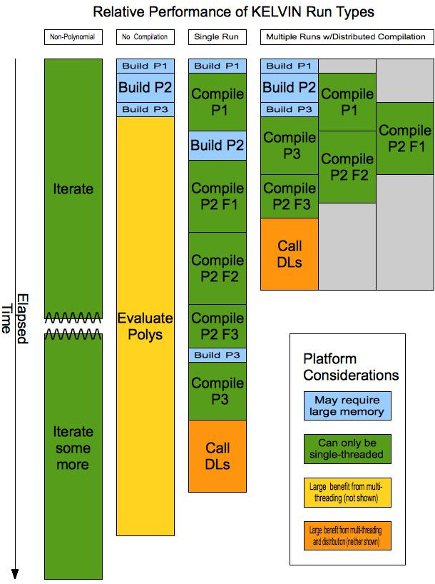

Kelvin-original Usage Contents
==============================

* [Source Code Info](#source-code-info)
* [Preparing The Configuration File](#preparing-the-configuration-file)
* [Input Data File Formats](#input-data-file-formats)
* [Running The Programs](#running-the-programs)
* [Contents Of Output Files](#contents-of-output-files)
* [Sequential Updating](#sequential-updating)
* [Compiled Polynomials](#compiled-polynomials)
* [Configuration File Directives Reference](#configuration-file-directives-reference)

---

Source Code Info
================

Kelvin is written in ANSI C, with some supporting scripts in Perl. Kelvin can generally be expected to run on any relatively recent Linux or Unix distribution. It has been successfully built with various versions of the [GNU C Compiler (GCC)](http://gcc.gnu.org) and the Intel C Compiler (ICC).

Kelvin releases have historically been tested on the following platforms:

* Redhat Enterprise Linux x86_64 with GCC 4.1.1
* Debian Linux i386 with GCC 4.1.1
* Macintosh OSX 10.6 i686 with GCC 4.2.1 and GCC 4.3.0
* Macintosh OSX 10.4 PowerPC with GCC 4.0.1 (no OpenMP)
* Cygwin under Windows XP i386 with GCC 4.3.4
* SunOS 5.8 on an Ultra-1 sparc 64-bit with GCC 3.4.6 (no OpenMP)

Kelvin may make very extensive use of memory management, and can, under most circumstances, definitely benefit from a drop-in allocator such as [Hoard](http://www.hoard.org/) or [ptmalloc3](http://www.malloc.de/en/). Either of these can easily halve execution time, and will keep memory fragmentation down when running in multi-threaded mode, but they are not required. These are controlled by the compilation conditionals `USE_PTMALLOC` and `USE_HOARD`; Hoard usage is disabled by default; ptmalloc3 usage is enabled if it is available on your platform and otherwise disabled by default.

---

Preparing The Configuration File
================================

Kelvin typically takes all of its configuration information from a single file specified on the command line. This file is composed of directives that describe the analysis to be performed, and the locations of supporting data files. We provide a complete reference to Kelvin directives and several examples [at the bottom of this document](#configuration-file-directives-reference)

In addition to the configuration file, any valid directive may be specified on the command line by prepending the directive with '--' (two hyphens). Any additional arguments on the command line will be treated as arguments to the directive, up to the end of the line, or the next directive, which again must be prepended with '--'. Directives on the command line that specify input or output files will override the values set in the configuration file. Directives that take a series or range of values (like [TraitPositions](#traitpositions)), will add to the values, if any, specified in the configuration file. There is currently no way from the command line to remove values set in the configuration file.

Kelvin supports a wide variety of analyses and options. These can be broken into general categories, with a small number of possibilities for each category. Some analyses/options are compatible with other analyses/options, some are not.

Two-Point vs. Multipoint
------------------------

Two-point analysis is the default. Multipoint analysis is enabled with the [Multipoint](#multipoint) directive. Multipoint analysis is incompatible with [linkage disequilibrium](#linkage-disequilibrium-association-vs-linkage-equilibrium) and [marker-to-marker](#trait-to-marker-vs-marker-to-marker) analyses.

Linkage Disequilibrium (Association) vs. Linkage Equilibrium
------------------------------------------------------------

Linkage equilibrium is the default for [two-point](#two-point-vs-multipoint) analyses, and is the only option for [multipoint](#two-point-vs-multipoint) analyses. Linkage Disequilibrium can be enabled for two-point analyses with the [LD](#ld) directive.

Dichotomous Trait vs. Quantitative Trait vs. Quantitative Trait With Threshold
------------------------------------------------------------------------------

A dichotomous trait model is the default. A quantitative trait model can be specified with the [QT](#qt) directive. A quantitative trait model with a threshold can be specified with the [QTT](#qtt) and [Threshold](#threshold) directives.

Sex Averaged vs. Sex Specific
-----------------------------

By default, Kelvin will perform its calculations using the sex-averaged centiMorgan marker positions in the map file. If sex-specific marker positions are available, Kelvin can be made to use those with the [SexSpecific](#sexspecific) directive. Sex-specific maps are not supported for [LD](#linkage-disequilibrium-association-vs-linkage-equilibrium) analyses.

Imprinting vs. Non-imprinting
-----------------------------

Kelvin will ignore the possibility of imprinting (parent-of-origin) effects by default. Imprinting effects can be allowed for by specifying the [Imprinting](#imprinting) directive.

Trait-to-Marker vs. Marker-to-Marker
------------------------------------

Trait-to-marker analysis is the default, and considers the relationship between a hypothetical trait locus and a marker or group of markers. Marker-to-marker analysis is enabled with the [MarkerToMarker](#markertomarker) directive, and considers the relationship between pairs of markers only.

Covariate-Dependent vs. Non-Covariate-Dependent
-----------------------------------------------

By default, Kelvin does not condition penetrances (or QT parameters) on covariates. Kelvin can be made to allow covariate-dependent penetrances (or QT parameters) with the [LiabilityClasses](#liabilityclasses) directive, and appropriate entries in the [pedigree](#pedigree-file) and [locus](#locus-file) files, whieh assign individuals to different liability classe. Covariate dependence does not currently work with [epistasis](#single-locus-analysis-vs-epistasis) analyses.

Single Locus Analysis vs. Epistasis
-----------------------------------

By default, Kelvin conducts single locus analysis. The [Epistasis](#epistasis) directive will provide a two-locus model in which penetrances at one locus are allowed to depend upon genotypes at a specified marker. Currently, this marker must be a SNP (two alleles only), and epistasis analysis does not work with additional [covariate dependence](#covariate-dependent-vs-non-covariate-dependent).

Automatic Pedigree Counting
---------------------------

By default, Kelvin will attempt to count and bin pedigrees to reduce computation. It does this by examining the pedigree file prior to analysis, and identifying combinations of pedigree structure, phenotype and genotype that appear more than once. Each unique combination need only be analyzed once, thus reducing the total number of computations. This mechanism will realize the greatest gains for datasets containing mostly small pedigrees: cases-and-controls, trios and affected sib-pairs.

Automatic pedigree counting will be implicitly disabled if any of the following are true:

* If the [MultiPoint](#multipoint) directive is present.
* If either the [QT](#qt) or [QTT](#qtt) directive is present.
* If the dataset contains microsatellites.

Automatic pedigree counting can be explicitly disabled with the [SkipPedCount](#skippedcount) directive.

Automatic Allele Frequency Estimation
-------------------------------------

Kelvin typically requires that allele frequencies be provided using the [FrequencyFile](#frequencyfile) directive. However, Kelvin will estimate allele frequencies internally in specific circumstances:

* The analysis must be a linkage disequilibrium analysis (specified with the [LD](#ld) directive).
* The pedigree must contain only cases-and-controls, or simple nuclear families (exactly two founders and one or more full-sibling offspring).
* For any given marker, at least 30 families (any combination of cases-and-controls or nuclear families) must contain useful genotype information.
* All markers must have no more than two alleles (SNPs).
* If the pedigree contains cases-and-controls, and the trait is dichotomous, then a trait prevalence must be specified with the [TraitPrevalence](#traitprevalence) directive.

If Kelvin can estimate allele frequencies, it will use those allele frequencies in preference to any provided using the [FrequencyFile](#frequencyfile) directive. Automatic allele frequency estimation can be explicitly disabled with the [SkipEstimation](#skipestimation) directive.

Kelvin will exit with error if allele frequency estimation is not possible and the [FrequencyFile](#frequencyfile) directive is not present.

---

Input Data File Formats
=======================

Kelvin typically requires four input data files: a pedigree file, a locus file, a map file, and a frequency file. The frequency file may be omitted if Kelvin is to estimate allele frequencies internally.

Pedigree File
-------------

Kelvin will accept either a pre- or post-[MAKEPED](http://linkage.rockefeller.edu/soft/linkage/sec2.7.html) format pedigree file. MAKEPED is part of the LINKAGE package. The only exception is that for pedigrees that contain loops, or if the proband must be explicitly specified, then a post-MAKEPED pedigree file is required. While it is possible to create a post-MAKEPED pedigree file by hand, it's much easier to create a pre-MAKEPED pedigree file, and run it through MAKEPED. Each line of a pre-MAKEPED pedigree file must start with five columns:

1. Pedigree ID - All individuals in the same family must have the same Pedigree ID.
2. Individual ID - The Individual ID must be unique inside a family. The combination of Pedigree ID and Individual ID must be unique inside the pedigree file.
3. Father ID - this should be the Individual ID of the individual that is the father of the current individual. This should be '0' (zero) if the father of the current individual does not appear in the pedigree file.
4. Mother ID - as above, for the current individual's mother.
5. Sex - a `1` (one) if the current individual is male, or a `2` if female.

The remaining columns in the pedigree file are governed by the [locus file](#locus-file). The pedigree file may contain any combination of cases-and-controls, nuclear families (defined as two founder parents and one or more children) or general pedigrees.

Locus File
----------

This file may be referred to as a 'data file' in documentation for older versions of Kelvin. Each line in a locus file consists of an identifier character, and a label. Each line corresponds to one (or two) columns in the pedigree file. The locus file defines the number and order of columns in the pedigree file. The identifier characters, and their meanings, are as follows:

* `A` - Phenotype status/trait value. Corresponds to a single column in the pedigree file, which indicates if individuals are affected, unaffected, unknown, or (for [quantitative trait](#dichotomous-trait-vs-quantitative-trait-vs-quantitative-trait-with-threshold) analyses) the trait value. [Trait-to-marker](#trait-to-marker-vs-marker-to-marker) analyses must have a phenotype status/trait line in the locus file, and the trait label will appear in all output files. A phenotype status/trait line need not appear for marker-to-marker analyses. The specific values that indicate affected, unaffected, etc., are controlled by the [PhenoCodes](#phenocodes) configuration directive.
* `T` - Used interchangeably with `A` in Kelvin.
* `C` - Covariate (Liability Class). Corresponds to a single column in the pedigree file. The values in this column are used to group individuals into liability classes to allow for covariate dependence of the penetrances (or QT parameters).
* `M` - Marker. Corresponds to two adjacent columns in the pedigree file. The values in these columns indicate the alleles of the named marker for each individual. Every marker that is listed in the locus file must also appear in the [map file](#map-file) and the [frequency file](#frequency-file).

Kelvin currently requires that, if a phenotye status column is present, it must appear first, before any markers. If a covariate column is present, it must appear immediately after the phenotype status column, before any markers.

Map File
--------

This file lists the positions of markers on the chromosome, in either Kosambi or Haldane centiMorgans. The first line of the file may optionally explicitly indicate the map function in use:

    mapFunction=haldane

The rest of the file must consist of three (or more) columns, each identified by a column header on the first (after the optional mapFunction) line. The column headers are as follows:

* `CHROMOSOME` or `CHR` - The chromosome number. Kelvin currently does not allow map files to contain markers from multiple chromosomes.
* `MARKER` or `NAME` - The marker name. Marker names may contain numbers, letters, underscores and hyphens only.
* `POSITION` or `POS` or `KOSAMBI` or `HALDANE` - The sex-averaged centiMorgan position of the marker. If the column header is `KOSAMBI` or `HALDANE`, the map function will be set accordingly.
* `MALE` or `MALEPOSITION` - The male sex-specific centiMorgan position of the marker. This column is only required for [sex-specific](#sex-averaged-vs-sex-specific) analyses, and will be ignored otherwise.
* `FEMALE` or `FEMALEPOSITION` - Same as `MALE`, but for females.
* `PHYSICAL` or `BASEPAIR` - The basepair position of the marker. This column is optional. If present, this value will appear in some output files.

If the map function is specified by both a `mapFunction` line and by a column header, the same map function must be specified. If the map function is specified by neither, the default is Kosambi.

Frequency File
--------------

This file identifies the alleles for each marker, and the specifies the frequencies for those alleles. This file is only required if Kelvin cannot [estimate allele frequencies](#automatic-allele-frequency-estimation) internally. The file is composed of a series of line groups. Each group begins with a marker line, followed by one or more allele lines. Similar to the [locus file](#locus-file), each line starts with an identifier character:

* `M` - Marker line. Should be followed by the marker name only. Starts a new line group, and implicitly finishes any previous line group, if any.
* `F` - Unlabeled alleles. Must be followed by only space-separated frequencies. This implicitly creates alleles labeled with consecutive numbers, starting with '1'. Multiple `F` lines may appear in a line group; the implied labels will be consecutive with implied labels from previous `F` lines.
* `A` - Labeled alleles. Must be followed by an allele label and the frequency for that allele. Each allele must be specified on a separate line.

For any given marker, alleles must all be specified as labeled or unlabeled, although different markers in the same frequency file may use either method.

Example of File Formats
-----------------------

Pedigree File (pre-MAKEPED):

    212 101 0   0   1   1   3   4   1   3   2   2   1   2   1   1
    212 102 0   0   2   0   1   2   2   3   2   2   1   1   2   2
    212 103 101 102 1   1   3   2   3   3   2   2   1   2   2   1
    212 104 0   0   2   1   1   4   1   1   1   2   1   2   1   1
    212 105 103 104 1   2   3   1   1   3   2   2   2   2   2   2

Locus File:

    A WebbedToes
    M rs2112
    M SNP_A-90125
    M SNP_GO-7188
    M rs8675309
    M rs1984

In this example, we have a small three-generation family. The pedigree ID (`212`) is in column 1, and individual IDs (`101` through `105`) are in column 2. Note that individual IDs do not need to be consecutive. The father and mother IDs are in columns 3 and 4, respectively. Individuals `101`, `102` and `104` are _founders_ (their parents are not present in the pedigree), so their father and mother IDs are coded with `0` (zeros). Individual `103` is descended from individuals `101` and `102`; individual `105` is descended from individuals `103` and `105`. Sex indicators are in column 5; individuals `101`, `103` and `105` are males, and individuals `102` and `104` are females. The remaining columns are defined by the locus file.

Line 1 of the locus file specifies a phenotype status column, which corresponds to column 6 in the pedigree file. This column follows the typical convention of dichotomous traits, coding unaffected individuals with a `1` (one), affected individuals with a `2` and unphenotyped individuals with a `0` (zero).

Each of the remaining lines in locus file specify markers, and correspond to two columns in the pedigree file: locus file line 2 corresponds to pedigree file columns 7 and 8, line 3 to columns 9 and 10, etc. For a fun exercise, spot the impossible inheritance in the sample pedigree.

Installing MAKEPED is beyond the scope of this documentation, but the general command to process a pedigree file with MAKEPED is:

`makeped ped.pre ped.post n`

where `ped.pre` is the pre-MAKEPED file you've created, `ped.post` is the post-MAKEPED file you want to create, and the last argument is either `y` or `n`, depending on if any of the families in the pedigree file do or do not contain consanguinity loops.

Map File:

    CHR  MARKER       KOSAMBI
    2    rs2112       1.732
    2    SNP_A-90125  2.2361
    2    SNP_GO-7188  2.6458
    2    rs8675309    3.3166
    2    rs1984       3.6056

The map file contains the minimum three columns: chromosome (column 1), marker (column 2) and sex-averaged centiMorgan position (column 3). The map function is not explicitly specified with a `mapFunction` line, but the header of the column 3 specifies a Kosambi map. If that header was `HALDANE`, then a Haldance map would be specified, or of the header was `POS` or `POSITION`, then the map function would default to Kosambi.

Frequency File:

    M rs2112
    F 0.233 0.377
    F 0.300 0.090
    M SNP_A-90125
    F 0.357 0.223 0.420
    M SNP_GO-7188
    A 2 0.866
    A 1 0.134
    M rs8675309
    A 1 0.455
    A 2 0.545
    M rs1984
    F 1.000

The frequency file contains five line groups, one for each marker. Lines 1 through 3 specify marker `rs2112` with four unlabeled alleles, which will be implicitly labeled 1, 2, 3 and 4, with corresponding frequencies of 0.233, 0.377, 0.300 and 0.090. Lines 4 and 5 specify marker `SNP_A-90125` with three unlabeled alleles. Lines 6 through 8 specify marker `SNP_GO-7188` with two labeled alleles: `2`, with a frequency of 0.866, and `1`, with a frequency of 0.134. Lines 9 through 11 specifiy marker `rs8675309` with two labeled alleles. Lines 12 and 13 specify a marker `rs1984` with a single unlabeled allele with a frequency of 1.000. Note than in no case are labeled and unlabelled alleles mixed within a single marker.

---

Running The Programs
====================

Once you have installed Kelvin, you can run it from your data directory, where you keep your configuration and data files. Kelvin takes only one parameter, which is the name of the configuration file, e.g.:

`Kelvin kelvin.conf`

Remember that if you did not specify absolute paths for output files in the configuration file, they will be written relative to your current directory.

It is often important to capture all output from a run into a file so that you may review it more after the run completes, or send it to us for diagnosis. The following command (using `sh`/`ksh`/`bash` syntax) runs Kelvin with all output redirected to a file called `kelvin.out`:

`Kelvin kelvin.conf > kelvin.out 2>&1`

Or, using `csh`/`tcsh` syntax:

`Kelvin kelvin.conf >& kelvin.out`

If you do need to send us information for diagnosis, please include the configuration and data files along with the output from the run.

Status Messages
---------------

When Kelvin is run, it first displays version, build and configuration information. All messages are prefaced with the current date and time. Messages fall into three categories:

1. **Progress messages**, which begin with an at-sign (@) and elapsed time from the start of the run. They are indented according to their level of detail. They are relatively inconsequential, and intended only to let you know how much progress has been made on the analysis. You can control how much detail is provided and how frequently messages are displayed with the [ProgressLevel](#progresslevel) and [ProgressDelaySeconds](#progressdelayseconds) directives.
2. **Diagnostic messages**, which begin with a severity indication and then provide a description of the difficulty encountered. Severity levels are **WARNING**, which indicates a potential problem that requires your attention in order to ensure the integrity of the analysis results; **ERROR**, which indicates some kind of analysis problem that will prevent the run from continuing; and **FATAL**, which indicates an internal integrity failure in Kelvin that should be brought to the attention of the developers.
3. **Informational messages**, are essentially everything else, and while helpful, do not necessarily need to be reviewed in order to ensure the integrity of the analysis results.

For example:

    10/01/15 08:26:25 @0s, Initializing
    10/01/15 08:26:25 kelvin V0.38.1 edit 2463 built Jan 14 2010 15:04:43
    10/01/15 08:26:25 Compiler 4.1.1 20070105 (Red Hat 4.1.1-52)
    10/01/15 08:26:25 Using GNU Scientific Library (GSL) statistical functions instead of internal ones
    10/01/15 08:26:25 OpenMP-enabled w/maximum of 6 thread(s).
    10/01/15 08:26:25 GCC optimization level 2 enabled
    10/01/15 08:26:25 To check status (at some risk), type CTRL-\ or type "kill -3 22860"
    10/01/15 08:26:25 Using configuration file kelvin.conf
    10/01/15 08:26:25 Computation is done in polynomial mode
    10/01/15 08:26:25 polynomialScale is 1 (1-10, 1 is default)
    10/01/15 08:26:25 Integration is done numerically (dkelvin)
    10/01/15 08:26:25 Further progress will be displayed at 90 second intervals
    10/01/15 08:26:25 6TL of 20AL*6GF*275pv(1LC) space for 24 pedigree(s)
    10/01/15 08:26:25 Trait-to-marker, Sex-Averaged Multipoint (w/4 loci), Dichotomous Trait.
    10/01/15 08:26:25 @0s, Performing analysis
    10/01/15 08:26:26    @1s, Starting with position 1 of 6
    10/01/15 08:27:56        @1m30s, Building polynomial w/pedigree: 12 (12/24)
    10/01/15 09:26:20        @2m32s, Building polynomial w/pedigree: 24 (24/24)
    10/01/15 09:26:20            @3m59s, Evaluating polynomials, currently at 8.1e+03 iterations

Lines 1 and 15-19 are progress messages. Line 2 is the Kelvin major version and build information. Next is the compiler verison number (line 3), followed by important compilation conditionals as specified in the Makefile and run characteristics as influenced by environment variables. In the example given, OpenMP support status and the number of threads used (line 5) is displayed.

Following this is a line (7) describing the action to take in order to force an early display of progress messages. You can use this as a sort of "pulse check" to make sure Kelvin is still alive and well and making progress should there be a lull between automatic progress updates. If you are running Kelvin interactively, you can perform this "pulse check" by type `CTRL-\ ` (that means to hold down the CTRL or CONTROL key while pressing the backslash). If you are running under cygwin, you will first need to type `stty quit ^C` to make this to work. Note that the aforementioned `^C` is actually the two character sequence of 'carat' (shifted 6) and 'C'. Pressing `CTRL-\ ` sends a SIGQUIT signal to Kelvin, which it interprets as a request for status. If you are running Kelvin as a detached process or in a batch queue, you can send a SIGQUIT to the process by being logged-into the same node as it is running on, and using the `kill` command as described in the diagnostic output. Note that the signal number (-3 in the example) can be different from platform-to-platform, and the process ID (26577 in the example) will be different from run-to-run. The "at some risk" bit is because some status information is displayed asynchronously, i.e. regardless of the current context of the evaluation, and has been known, albeit extremely infrequently, to crash the program.

Next, location of the configuration file (line 8) and the analysis and run characteristics as determined from that file (lines 9-12) are displayed. The last of these (lines 13 and 14) are a terse description of the scope and nature of the analysis, for example a multipoint run might display:

    8TL over a dynamic space (1LC) for 11 pedigree(s)
    Trait-to-marker, Sex-Averaged Multipoint (w/4 loci), Dichotomous Trait.

This indicates that for each of 8 trait loci, PPLs will be computed using the closest 4 markers, integrating over a dynamically-sampled trait space, with all individuals in a single liability class. A two-point analysis will provide slightly different information, e.g.:

    67D' cases over a dynamic space (1LC) for 4 pedigree(s)
    Trait-to-marker Two-Point, Dichotomous Trait, Linkage Disequilibrium.

This indicates that for each of 67 initial D' values, two-point PPLs and LD statistics will be computed, integrating over a dynamically-sampled trait space, with all individuals in a single liability class.

Finally, progress indicators are displayed up through the end of the run.

---

Contents Of Output Files
========================

Kelvin produces several different files of results depending upon the
type of analysis performed.

Bayes Ratio File
----------------

Integrated likelihood ratio (BR) information is produced for all runs. It is written to the file `br.out` by default, although that filename is configurable. The first line written to the file is a comment that contains the Kelvin version number, e.g.:

    # Version V0.38.1 edit 2463

This is included so that results can be associated with the version of Kelvin that produced them, and will allow for variations in algorithms, file formats and data precision. Subsequent lines contain different information for each type of analysis being performed:

### Multipoint Analysis

For multipoint runs, a single table with a header line is output. The table consists of one row for each trait position. Columns are whitespace-delimited:

1. Chr - chromosome number
2. Position - trait positions in centiMorgans
3. PPL - the posterior probability of linkage. This is rounded to two places if .025 or greater, and three decimal places otherwise.
4. BayesRatio - integrated likelihood ratio.
5. MarkerList(...) - parenthesised list of the closest N markers for each position, where N is the number of markers being considered at a time. Header text reflects actual count of columns.

### Two-point Analysis

Two-point analyses output separate tables for each locus. Each table is prefaced with a comment line that details the chromosome, name and position of the current marker, e.g.:

    # Seq: 1 Chr: 1 Trait: disease Marker: 1_3_mrk Position: 0.9900

and consists of one row of whitespace-delimited values for each value of D' (in the case of an LD analysis) and theta. Columns are whitespace-delimited:

1. multiple columns of D<i>nm</i> - the D' (d-prime) between allele <i>m</i> of the trait and allele <i>n</i> of the marker. There will be (<i>n</i>-1)\*(<i>m</i>-1) columns present for linkage disequilibrium runs. These columns are not present on LE runs because LE is a special case of LD where D' is always 0. Note that the number of D' columns will vary within an analysis when the number of marker alleles varies.
2. Theta(M,F) - male and female theta values. They are identical for a sex-averaged analysis.
3. BayesRatio - integrated likelihood ratio.

Posterior Probability of Linkage (PPL) File
-------------------------------------------

Separate PPL information is produced for two-point and marker-to-marker analyses. It is written to the file `ppl.out` by default, although that filename in configurable. The first line is a comment that contains the Kelvin version number as with the Bayes Ratio file. The next line is a header, followed by one line of whitespace-delimited values for each marker in the run.

1. Chr - chromosome number.
2. Trait/Marker1 - trait name for trait-to-marker analysis, first marker name for marker-to-marker analysis.
3. Position1 - first marker position in centiMorgans (not present for trait-to-marker analysis).
4. Marker/Marker2 - marker name for trait-to-marker analysis, second marker name for marker-to-marker analysis.
5. Position/Position2 - marker position in centiMorgans.
6. PPL - posterior probability of linkage. Evidence for or against linkage to the disease locus, not allowing for disequilibrium, i.e., D' is fixed at 0. It is rounded to two places if .025 or greater, and three decimal places otherwise.
7. PPL(LD) (only for LD analyses) - evidence for or against linkage allowing for disequilibrium. The PPL(LD) is rounded to two places if .025 or greater, and three decimal places otherwise.
8. PPLD|L (only for LD analyses) - Posterior probability of LD, given linkage. The PPLD|L is rounded like the PPL(LD).
9. PPLD (only for LD analyses) - posterior probability of linkage and linkage disequilibrium, The PPLD is rounded like the PPL(LD).

Maximizing Model (MOD) File
---------------------------

All analyses can optionally write maximizing models to a separate file, named `mod.out` by default, although that name is configurable. In all cases, the first line is a comment line that identifies the version of Kelvin that created the file. Note that due to Kelvin's use of an efficient numerical integration algorithm, there is no guarantee that the maximum MOD will occur at the true maximum values of all parameters. The default integration routine can be overridden in order to perform maximization over a fixed grid of user-specified parameter values for precise maximization.

### Multipoint Analysis

For multipoint runs, a single table with a header line is output. The table consits of one row for each trait position, containing the values of all trait parameters that maximized the likelihood at that position. Columns are whitespace delimited:

1. Chr - chromosome number
2. Position - trait positions in centiMorgans
3. MOD - maximum LOD score achieved at this position.
4. Alpha - the value of alpha that maximized the HLOD score.
5. DGF - the maximizing disease gene frequency.
6. LC`n`PV(...) - the maximizing penetrance vector, one for each liability (covariate) class in the analysis. For dichotomous trait runs, it is three (or four, if imprinting effects are being considered) columns of the maximizing penetrance for DD, Dd, (dD,) and dd. For quantitative trait (QT) runs with the normal distribution, it is three (or four) columns of means followed by three (or four) of standard deviations for the maximizing distributions for DD, Dd, (dD,) and dd, followed by the threshold in the case of the QTT model. Quantitative trait runs with the Chi-Square distribution have only three (or four) columns of degrees of freedom followed by the threshold. Values are comma-separated and enclosed in parentheses. Header text reflects actual count and nature of columns. Again, the models reported here may not represent true maximizing models, if the integration algorithm has bypassed the true overall maximum of the parameter space.

### Two-point Analysis

For two-point analyses, a separate table is output for each marker, or pair of markers, in the case of marker-to-marker analyses. Each table is prefaced with a comment line that details the chromosome, name and position of the marker (or markers). For marker-to-trait analyses, this line is identical to that in the Bayes Ratio file. For marker-to-marker, the line looks like:

    # Seq: 2 Chr 1: Marker1: 1_3_mrk Position1: 0.9900 Marker2: 1_4_mrk Position2: 1.3200

Each table is prefaced with a header line. Columns are whitespace-delimited:

1. Case - Identifies the model as maximizing overall, or maximizing where theta is 0, or (in the case of LD analyses) as maximizing where D' is 0.
2. MOD - maximum LOD score achieved for the current Case.
3. multiple columns of D' values, as described for two-point Bayes Ratio files. For LD analyses only.
4. Theta(M,F) - as described for two-point Bayes Ratio files.
5. Alpha, DGF and LC`n`PV(...) - as described for multipoint maximizing mode files. Not present in marker-to-marker analyses.
6. R2 - the standard LD correlation coefficient. Only present in marker-to-marker runs.

---

Sequential Updating
===================

Sequential updating is a method for combining the results of multiple analyses in post-processing. Sequential updating tools are included in the Kelvin distribution.

calc_updated_ppl
----------------

This program takes one or more Kelvin-format Bayes ratio files, and produces PPL (and, if appropriate) PPLD statistics. If a single Bayes ratio file is provided, `calc_updated_ppl` simply reproduces the PPL statistics generated by the original analysis. If multiple Bayes ratio files are provided, the Bayes ratios are sequentially updated and new PPL statistics are generated.

`calc_updated_ppl` can also use the PPL statistics generated by a multipoint analysis as prior probabilities when calculating the PPLD (posterior probability of linkage and LD) statistic. In this way, the results of a linkage analysis can be combined with an LD analysis. Both the linkage and LD analyses must be aligned against the the same map.

By default, `calc_updated_ppl` expects Bayes ratio files from two-point, sex-averaged analyses, in the most recent format, and displays PPL statisics. Bayes ratio files created using older (pre-2.1) versions of Kelvin must be converted to the current format using the provided [conversion script](#convert_brpl). All input files must contain Bayes ratios for the same markers, in the same order. The default behavior can be modified with a number of command line flags:

`-m`, `--multipoint`
:   Specifies that the input Bayes ratio files are from multipoint analyses. PPLs will be calculated at each position that appears in any of the input files. If a given position does not appear in all files, the updated PPL will be calculated using only the files in which the position does appear.

`-s`, `--sexspecific`
:   Specifies that the input Bayes ratio files were created using a sex-specific map.

`-M [mapfile]`, `--mapin [mapfile]`
:   Specifies a map file for input. Only valid with two-point Bayes ratio files. When a map is provided, individual Bayes ratio files are permitted to omit some markers. Each file may only contain markers that appear in the map, and they must all appear in the same order as they appear in the map. Updated statistics will be calculated for each marker that appears in at least one Bayes ratio file.

`-f`, `--forcemap`
:   Specifies that marker position information in Bayes ratio files should be ignored, and marker positions from a supplied map should be used instead. Requires that a map have been provided with `--mapin`.

`-R [pplfile]`, `--pplout [pplfile]`
:   Specifies the name of a file to which updated PPL statistics should be written, rather than displaying them.

`-O [brfile]`, `--partout [brfile]`
:   Specifies the name of a file to which updated Bayes ratios should be written.

`-P [pplfile]`, `--pplin [pplfile]`
:   Specifies the name of a file containing multipoint PPLs which should be used as prior probabilities for calculating the PPLD statistic. This new statistic is labled cPPLD (combined PPLD). For each marker in the LD analysis, the prior probability will be sampled from the multipoint PPLs. If there is no PPL at the exact marker position, one will be estimated using linear interpolation.

`-r`, `--relax`
:   Specifies that marker names in Bayes ratio files should be ignored, and that updated statistics should be calculated using Bayes ratios from all files in the order in which it appears. This option should be used WITH CAUTION, since it implies that the same markers appear in different analyses with different names.

`-?`, `--help`
:   Displays usage help.

### Examples

Here's a simple example of updating across two two-point Bayes ratio files, and saving the updated statistics to a file:

`calc_updated_ppl br1.out br2.out > updated-ppl.out`

Here's an example of updating across three multipoint Bayes ratio files, and requests that the updated Bayes Ratios be written to the file `br-updated.out`:

`calc_updated_ppl -m --partout br-updated.out br1.out br2.out > updated-ppl.out`

Here's an example of updating across three two-point Bayes ratio files, each of which contains a slightly different subset of the total set of markers. A map file is required in this case:

`calc_updated_ppl --mapin complete.map br1.out br2.out br3.out > updated-ppl.out`

Here's an example of using multipoint PPLs with a single two-point, LD Bayes ratio file. This just recalculates the PPLD statistics for the given Bayes ratios, but uses the multipoint PPLs as priors for the PPLD statistic (producing the cPPLD statistic):

`calc_updated_ppl --pplin mp-ppl.out br.out > cppld.out`

convert_br.pl
-------------

This Perl script will convert `avghet.out` or `br.out` files generated by
older versions of Kelvin into the most recent format. Output is
always to the terminal.

`-m [mapfile]`
:   If the Bayes ratio file was generated by Kelvin 0.36.0 or earlier, it will contain no Position column. In this case, a mapfile may be provided, and the marker positions from the mapfile will be used to fill position information in the output Bayes ratio file. If the string `nomap` is passed, instead of a mapfile, then the marker positions will be filled with sequential integers.

`-c [chrnum]`
:   If the Bayes ratio file was generated by Kelvin 0.34.2 or earlier, there will be no Chromosome column. In this case, the user must specify the chromosome.

### Examples

Here's an example that captures the output to a file:

`convert_br.pl -c 12 -m mapfile.dat avghet-old.out > br-new.out`

Note in this example, `-c 12` specifies that `avghet-old.out` contains data from an analysis of chromosome 12, and that marker position information is in the file `mapfile.dat`. A full description of command line syntax is available by typing:

`convert_br.pl --help`

---

Compiled Polynomials
====================

If you have a homogeneous multi-machine Linux/GCC environment such as a Beowulf cluster and are performing long-running analyses, you may be able to benefit from using compiled polynomials, which can provide an order of magnitude improvement in evaluation performance, and a degree of reusability.

How Does Kelvin use Polynomials?
--------------------------------

In order to understand the value of polynomial compilation, one must first understand what polynomials are and how Kelvin uses them.

When Kelvin performs an analysis, the majority of the work is calculating the likelihood of every pedigree's structure and characteristics for each combination of values in the trait model space, which is typically a range of 6 gene frequencies, 275 penetrances, and 20 alpha values, or 33,000 combinations of values. This is repeated for each trait position in the analysis.

In (original) non-polynomial mode, the pedigree likelihood is explicitly calculated via a series of tests, loops and arithmetic operations in the compiled code that comprises Kelvin. Since these tests, loops and operations are all hard-coded in the program, they cannot be optimized or simplified in response to the nature of each pedigree, so the same full series of steps is followed for every combination of values.

In polynomial mode, we go thru this same hard-coded path in Kelvin _one time only_ building a symbolic representation of the calculation using place-holder variables from the trait model space instead of actual numeric values. In effect, we build a polynomial that represents the structure and characteristics of the pedigree in terms of the variables from the trait model space. This polynomial representation can then be extensively simplified and optimized using mathematical and computational techniques so that when we assign trait model space values to the place-holder variables and evaluate it, it can perform the calculation orders of magnitude faster than the original hard-coded path in Kelvin.

This process of generating polynomials has its own drawbacks. They can take a lot of time and memory to generate and optimize, and even when optimization is complete, their evaluation is symbolic and therefore slower than the equivalent binary operations. Ideally, we'd like to have both the optimized simplicity of the pedigree/position-specific polynomial _and_ the performance and reusability of compiled code. The solution is to generate and compile code representing each polynomial.

What Polynomials Are Built?
---------------------------

During a polynomial-mode analysis, a separate set of likelihood polynomials is built for each pedigree and combination of relative trait/marker positions. For example, a multipoint analysis with two pedigrees and three markers where evaluated trait positions occur between every pair of markers as well as before and after the markers would generate twelve polynomials:

* trait likelihood for pedigree 1
* trait likelihood for pedigree 2
* marker set likelihood for M1, M2, M3 and pedigree 1
* marker set likelihood for M1, M2, M3 and pedigree 2
* combined likelihood for pedigree 1 and trait/marker pattern T-M1-M2-M3
* combined likelihood for pedigree 2 and trait/marker pattern T-M1-M2-M3
* combined likelihood for pedigree 1 and trait/marker pattern M1-T-M2-M3
* combined likelihood for pedigree 2 and trait/marker pattern M1-T-M2-M3
* combined likelihood for pedigree 1 and trait/marker pattern M1-M2-T-M3
* combined likelihood for pedigree 2 and trait/marker pattern M1-M2-T-M3
* combined likelihood for pedigree 1 and trait/marker pattern M1-M2-M3-T
* combined likelihood for pedigree 2 and trait/marker pattern M1-M2-M3-T

The trait and marker likelihood polynomials are extremely simple compared to the combined likelihood polynomials. Marker likelihood polynomials usually simplify to a constant, while combined likelihood polynomials usually have tens of thousands, and sometimes even billions of terms.

What is Polynomial Compilation?
-------------------------------

Polynomial compilation is a method of post-processing a discrete, nameable, in-memory polynomial generated by Kelvin so as to facilitate rapid evaluation and reuse. By discrete and nameable, we mean that all information required for the construction of the polynomial is available before construction begins, and that there are a relatively small number of attributes that can be used to distinguish this particular polynomial from other similar ones and therefore comprise a unique name. Fortunately, Kelvin has been written in such a way that all major polynomials generated are both discrete and nameable.

When polynomial compilation is used, likelihood polynomials are built in-memory as usual in an initial Kelvin run, and then translated into C-language code and written to one or more source files which are then compiled into dynamic libraries. These dynamic libraries are reusable, distributable, compiled representations of the original polynomials that can be loaded on-demand and evaluated up to ten times faster than their original in-memory counterparts.

Once a dynamic library is built for a given polynomial, the relatively slow and memory-intensive process of generating that polynomial need not be performed again unless one of the following changes:

* Count or positions of markers.
* Structure of pedigrees.
* Phenotypic or genotypic characteristics of individuals.
* Type of analysis such as LD vs LE (two-point and multipoint analyses create differently-named polynomials and can therefore co-exist).

While compiled polynomial names incorporate enough information to uniquely identify them _within a given analysis run_, they do not contain an exhaustive description of the analysis, so it is important to be careful to remove any existing compiled polynomials (`*.so` files) when one of the aforementioned characteristics changes, otherwise Kelvin might crash, or worse -- the analysis results will be incorrect. You can, however, freely change any of the following analysis characteristics and still take advantage of any pre-existing compiled polynomials:

* Pedigrees included/excluded (new ones can be compiled or just built and used without compilation).
* Trait position values for multipoint analysis (may require additional polynomials).
* Gene frequency values.
* Penetrance values.
* Alpha values.
* D-prime values for LD analysis.

When To Use Polynomial Compilation
----------------------------------

Generally, you should use polynomial compilation only when it is technically feasible in your computational environment and the cost and complexity of compiling and linking dynamic libraries is exceeded by the benefits of rapid and repeatable evaluation.

### Indications

* **When the ratio of evaluations to trait/marker position changes is high.** This is an indication to use polynomial evaluation in general, and compilation in particular, as the costs of generation will be outweighed by the gains during evaluation.
* **When the run-time of an evaluation is prohibitive.** Compilation itself can reduce evaluation time by up to an order of magnitude. Furthermore, the compiled component polynomials of an analysis can be distributed easily across nodes in a cluster or throughout an entire network using middleware such as the Berkeley Open Infrastructure for Network Computing (BOINC). Evaluations that would take years in a serial context can be performed in days when widely-distributed.
* **When the same set of markers will be used with varying sets of pedigrees in multiple analyses.** Since named polynomials are specific to pedigree and trait/marker position, analyses that consider various subsets of a group of pedigrees pay the price of compilation only once for each pedigree and trait/marker position, and then reuse them without additional cost.
* **When a generated polynomial is extremely large.** Polynomials that are larger than physical memory can be generated successfully, but repeated evaluation becomes very costly as portions outside of physical memory must be swapped-in from disk for every iteration. Running at the boundaries of physical memory also tends to lead to more frequent crashes, so converting the polynomial to source code as soon as it is generated not only greatly reduces memory consumption and enhances evaluation performance, but also ensures that the work will not be lost to a crash.

### Contraindications

* When pedigrees are very simple.
* When only a single evaluation will be performed.

Phases in Compiled Polynomial Use
---------------------------------

Compiled polynomial use consists of several phases that have very different requirements and optimization possibilities:

1. **Polynomial build and code generation.** This is pretty much the same as the normal process of polynomial building that occurs whenever you use the `PE` directive in your analysis, coupled with the fairly quick additional step of generating a number of C-code files to represent the polynomial. This step is only performed if there is not already a compiled polynomial of the same name in the current default directory. As with the normal polynomial build process, this step can be very memory-intensive depending upon the structure of the pedigrees and number of positions in the analysis, and does not benefit significantly from running in a multi-threaded environment.

2. **Code compilation and dynamic library (DL) linking.** Compilation can be performed at the time the source is generated by Kelvin itself, or by way of batch jobs submitted on multiple nodes.
    Both approaches require:
    * the GNU C Compiler
    * `polynomial.h` and `polyDLLoop.c` from the distribution `pedlib/` directory copied to somewhere on the GCC include file search list, i.e. in `/usr/local/include` or in a directory specified by the `CPATH` environment variable.
    * `compileDL.sh` from the top-level distribution directory copied to somewhere on the command path, i.e. in a directory specified in the `PATH` environment variable. This script file is executed from within Kelvin to build dynamic libraries, and should be protected from unauthorized modification, as it would otherwise present a potential security risk. Currently this script moves source files to a `compiled` subdirectory once a dynamic library is built. You may wish to modify it's behavior or change the compilation optimization level.

    This step is only performed if code has been written and synchronous compilation specified.

    The source files generated are currently sized to be as large as can be compiled in under 16Gb of physical memory in order to facilitate optimization, and are compiled serially, so this step does not benefit at all from running in a multi-threaded environment.

3. **Compiled polynomial loading and evaluation.** An attempt is made to locate and load a dynamic library (`.so` file) for each polynomial (one per pedigree) required for evaluation at a specific position before evaluation begins. Only the current execution directory is searched -- **not** the normal default dynamic library paths, as moving the dynamic libraries out of their associated analysis directory would facilitate accidental misuse. Any polynomials not represented by an existing dynamic library are built, and may be coded, compiled and loaded. Evaluation of the polynomials for a position is done in parallel by pedigrees, and so takes advantage of a multi-threaded environment insofar as the pedigrees are of similar complexity.

Kelvin Polynomial Run Types
---------------------------

As the different phases of compiled polynomial processing have very different performance characteristics, two distinct mechanisms have been setup in Kelvin to support them. The first is a simplistic linear single-run approach which does not fully exploit performance capabilities, but can provide a significant performance boost over regular polynomial processing. The second is a relatively complicated multiple run process that achieves maximal performance. This chart illustrates the performance characteristics of these two approaches, along with the characteristics of a non-polynomial run and a polynomial run without compilation. The illustration assumes a simplified case where there is a single trait position for which three significant polynomials are generated (P1, P2, and P3), two of which are simple enough to be described by a single source file (P1 and P3), and one which requires three source files (P2 F1, F2, and F3).

The Kelvin binaries referenced below can be produced by executing `make specialty` in the top-level distribution directory. A future release of Kelvin will combine them all into a single binary whose operation will be controlled by command-line options.

* **Non-Polynomial Run.** This approach uses the `kelvin-normal` binary without the `PE` directive in the configuration file. It requires very little physical memory, but has a relatively long execution time which cannot be improved with multi-threading. Total run-time is easily and accurately extrapolated from initial progress, so a decision can be made fairly quickly as to whether this approach is worth pursuing.
* **Normal (No Compilation) Polynomial Run.** This approach uses the `kelvin-normal` binary with the `PE` directive specified in the configuration file. The initial phase - polynomial build - can take a large amount of memory and only benefits marginally by multi-threading. All pedigree polynomials share the same in-memory structure, which facilitates simplification. Once the polynomials are complete, they are evaluated symbolically, which benefits moderately from multi-threading, depending upon the number of pedigrees and their relative evaluation times.
* **Compiled Single Run.** In this approach, a single binary, `kelvin-POLYCOMP_DL`, is used to perform all of the steps of processing, from the initial build thru compilation and evaluation. While this simplifies the process, it cannot take advantage of distribution of the workload across multiple computers, nor the association of processing steps with optimal platform characteristics. As each polynomial is built, all of the files associated with it are compiled serially and then linked into a dynamic library, so the full price in elapsed time is paid for every compiled polynomial. It is particularly important to pay attention to trade-offs when considering this type of compiled polynomial run.
* **Compiled Multiple Runs.** In this approach, two different Kelvin binaries are used, and the best results are achieved using multiple machines. The initial polynomial build (and coding) step is performed all at once by `kelvin-POLYCODE_DL-FAKEEVALUATE`, which, as the name indicates, does not do a real evaluation of the polynomials as they are only being built in order to generate source files. This step is best performed on a single-processor machine with a large amount of memory, as it does not benefit significantly from multiple threads. As soon as the source files for the first polynomial have been generated, they can start being compiled into object files. Compilation is performed by `compileDL.sh`, which must be executed either interactively or in a batch stream for each named polynomial. `compileDL.sh` takes two parameters which are the name of the polynomial and the optimization level (0 or 1) to be used. If multiple source files were generated, `compileDL.sh` will compile them sequentially and then link them when finished. Multiple copies of `compileDL.sh` can be run on a single polynomial, in which case each will compile separate source files until all are done. In this situation, a final copy must be run to do the link.

    In the illustrated example, there are three separate machines being used. In practice, our entire cluster of 64 machines has at times been used to quickly compile and link a large number of polynomials. Once all generated source has been compiled, a second Kelvin binary, `kelvin-POLYUSE_DL`, is run. It uses dynamic libraries whenever it finds them instead of building the equivalent polynomials. If no dynamic library is found for a polynomial, the polynomial will be built-in memory. This step is best performed on a multi-core machine, and will, in the near future, be able to be distributed by other mechanisms.

### BCMM-specific Instructions for Compiled Single Run

While this approach is the easy way out, it's also the least efficient. If you have very large polynomials, you'll be waiting a long time for the compiles to complete, and will have to run only on 16Gb nodes.

Modify whatever shell script you use to run kelvin to:

1. Ensure that a copy of `compileDL.sh` is somewhere on your path. You might want to modify the script to e-mail you should a compile fail, instead of emailing Bill. This will look something like: `export PATH=/usr/local/src/kelvin-0.37.2/:$PATH`
2. Ensure that the `CPATH` environment variable includes the Kelvin source tree's `pedlib/` and `include/` directories. This will look something like: `export CPATH=/usr/local/src/kelvin-0.37.2/pedlib/:/usr/local/src/kelvin-0.37.2/include/`
3. Instead of running regular `kelvin`, run `kelvin-POLYCOMP_DL`. This binary is built with the `POLYUSE_DL`, `POLYCODE_DL`, and `POLYCOMP_DL` compilation flags set.

If a compile blows up, you'll need to not only fix the problem, which should be described in the `.out` file for the errant polynomial, but you'll also need to delete the `.compiling` file for that polynomial in order for a subsequent run to not skip it.

If you need to build a polynomial that's over 16Gb, use the binary `kelvin-POLYCODE_DL-FAKEEVALUATE-SSD` and use the SSD by setting two environment variables:  
`export sSDFileName=/ssd/cache.dat` (where `/ssd/` points to where the SSD is mounted)  
`export sSDFileSizeInGb=28`

If you need to restart a run, all you need to do to clean-up is get rid of `.compiling` files, and when you're using this approach, there should be only one of those. Note that once a dynamic library (`.so` file) is built for a polynomial, it needn't be built again. All `kelvin-POLY`-whatever programs are smart enough to simply use existing dynamic libraries and not try to recreate them. If you need to recreate them because the analysis changed in some fundamental way (see earlier documentation), then you'll need to delete the old `.so` files.

The default optimization level for compiles is "0" (zero), which compiles fairly fast, but produces dynamic libraries that run about half as fast as level "1" (one). If you want level "1" (one), you can edit the `compileDL.sh` script on your path to make it the default. Beware that compilation time will increase by a factor of 5. Note, however, that if you've already gone thru the generation of dynamic libraries with optimization level "0", you don't have to regenerate the code to compile at optimization level "1". Just delete (or move) the old `.so` files, copy the generated source (`.c` and `.h` files) up from the `compiled` subdirectory, and execute your modified `compileDL.sh` on them.

Finally, note that after you've gone thru the painful process of compiling all of the dynamic libraries needed for your analysis, you can start running `kelvin-POLYUSE_DL` to redo the analysis and get better performance not only because you're not doing compilation anymore, but also because `kelvin-POLYUSE_DL` is built with OpenMP support, unlike `kelvin-POLYCOMP_DL`. Remember to set `OMP_NUM_THREADS` to something like the number of available cores to get the most you can, and don't be disappointed if you don't see a big improvement -- our multi-threading is by pedigrees, so if there are only a couple, or they're very unbalanced (one huge one and a bunch of small ones), it might as well be single-threaded.

### BCMM-specific Instructions for Compiled Multiple Runs

This approach is best for many large pedigrees, and requires a bit of work. If you only have a few simple pedigrees, stick with the Compiled Single Run method.

You won't be using kelvin to do the actual compiles this time, so no special setup is needed. All you need to do is run `kelvin-POLYCODE-FAKEEVALUATE` and let it start generating the source code for polynomials. Note that while it will produce output files, they're garbage (the `FAKEEVALUATE` bit) because the whole point here is to produce source code as quickly as possible.

Now, as soon as `.h` files start being produced, you can start running `compileDL.sh` on them. I do this with a combination of a few scripts that find all `.h` files and automagically create batch jobs to execute commands (in this case `compileDL.sh`) on them. Look for `compile_1` and `compile_2` in my `.bashrc`. I do this multiple times when there are especially large polynomials involved, because each time `compileDL.sh` runs, it starts working on any as-yet-uncompiled components of the polynomial, so if there are 20 generated source files for a single polynomial, I could have as many as 20 copies of `compileDL.sh` productively running on it. Note that if you do have multiple copies of `compileDL.sh` running on a single polynomial, they'll compile all of the separate source components, but won't do the final link into a dynamic library for fear of missing pieces. Only a copy of `compileDL.sh` that doesn't skip any uncompiled pieces will attempt a link. This could be corrected by modifying `compileDL.sh` to do another check for any `.compiling` files once it's done, but I haven't had a chance to do that yet.

Once all of the polynomials generated have been compiled -- and you can tell when that's the case by looking to see if there are any `.h` files left, you can start evaluation. Use `kelvin-POLYUSE_DL` with some largish `OMP_NUM_THREADS` for best performance.

---

Configuration File Directives Reference
=======================================

Kelvin's configuration file format is intended to be easy to read and edit. Kelvin, in general, requires the user to explicitly specify what Kelvin is to do, and doesn't make any assumptions about what the user may or may not want. Kelvin will display helpful error messages and terminate if the configuration file contains incompatible directives.

Configuration File Format
-------------------------

The kelvin configuration file is a text file containing directives that describe the nature of the analysis to be performed, and the names of input and output files. Directives typically appear on separate lines, but multiple directives, separated by a semicolon (';'), may appear on the same line. Some directives require arguments, which must appear on the same line as the directive they modify. Blank lines in the configuration file are ignored. Extra white space (spaces and tabs) around directives and arguments is ignored. Comments may be embedded in a configuration file with a pound sign ('#'). The pound sign and any text, up to the end of the line, will be ignored. Comments may appear on a line by themselves, or at the end of a line that also contains a directive(s). In the latter case, a semicolon is not required to separate the directive and the comment.

Directives
----------

Directives are words or combinations of words with no intervening spaces. This document will capitalize the individual words that make up a directive (for example, `MapFile`), but they may appear in the configuration file with any capitalization (`Mapfile`, `mapfile`, `MAPFILE`, etc.). Also, directives may be abbreviated, so long as the abbreviation is unique. For example, `MapFile` could be abbreviated to `Map`. `SexLinked` could be abbreviated to `SexL`, but not to `Sex`, since that could also be an abbreviation for `SexSpecific`.

Arguments
---------

Most directives require one or more arguments, which will take one of the following forms:

* A Filename - a character string that must be a valid filename, optionally including a relative or absolute path preceding the filename. A filename may include an environment variable as an element of a fully specified or relative path, or as the name of the file itself. Environment variables must appear either at the beginning of the string, or immediately following the path separator ('/'). Kelvin will abort if a variable that appears as part of a filename is not defined in the environment. Generally, Kelvin will abort if a file given as input does not exist, and will overwrite a file given for output if it does exist. The total length of a filename may not exceed 256 characters.
* A Literal String - a few directives require a specific string as an argument. These strings may appear with any capitalization, but they should not be abbreviated.
* A Value - an integer or real number, depending on the directive.
* A Range - a shorthand method for specifying a series of values with a regular interval. A range is specified as a start value, a literal '`-`', an end value, a literal '`:`', and an increment. Start, end and increment values may be integers or real numbers. Start and end values may be positive or negative, with the restriction that the end must be no less than the start. The increment must be a positive value. Intervening whitespace may be added for clarity, but is not necessary. Kelvin will expand the range into a list of values that begins with the start value, increases by the increment, and ends with the last value that is no greater than the end value. For example, a range that runs from -1 to 1 in increments of 0.1 would be specified as '`-1 - 1 : 0.1`'. A range specified as '`0-1:0.15`' would expand to `0, 0.15 ... 0.75, 0.90`.

Sample Configuration File
-------------------------

Kelvin configuration files can be quite simple. Here's a file for a multipoint analysis that will generate PPLs for a dichotomous trait at one centiMorgan intervals, considering 4 markers around each trait position:

    # Sample multipoint, dictomous trait configuration
    
    MultiPoint 4
    TraitPositions 0-end:1
    
    PhenoCodes 0, 1, 2
    
    PedigreeFile ped.post
    LocusFile locus.dat
    MapFile map.dat
    FrequencyFile freq.dat
    BayesRatioFile br.out
    PPLFile ppl.out

Lines 3 and 4 specify a 4-marker multipoint analysis, and that the trait should be placed at 1 cM intervals, starting at 0 cM and running through the end of the map. Line 6 specifies the values that will appear in the affection status column in the pedigree file. Lines 8-13 specify input and output files.

Here's a file for two-point analysis that will generate PPLs and linkage disequilibrium statistics between a dichotomous trait and each marker in the dataset:

    # Sample two-point, dictomous trait LD configuration
    
    LD
    
    PhenoCodes 0, 1, 2
    
    PedigreeFile ped.post
    LocusFile locus.dat
    MapFile map.dat
    FrequencyFile freq.dat
    BayesRatioFile br.out
    PPLFile ppl.out
    MODFile mod.out
    ExtraMODs

Two-point analysis is the default, so no directive is necessary to specify that. Line 3 specifies a linkage disequilibrium analysis. Line 5 specifies the values that will appear in the affection status field of the pedigree. Lines 7-13 specify input and output files. Line 14 specifies that additional information should be written to the MOD file specified on line 13.

Directive Summary
-----------------

Kelvin directives are intended to be fairly self-descriptive.

### Input And Output
* [PedigreeFile](#pedigreefile)
* [LocusFile](#locusfile)
* [FrequencyFile](#frequencyfile)
* [MapFile](#mapfile)
* [BayesRatioFile](#bayesratiofile)
* [PPLFile](#pplfile)
* [MODFile](#modfile)
* [ExtraMODs](#extramods)
* [ProgressLevel](#progresslevel)
* [ProgressDelaySeconds](#progressdelayseconds)
* [EpistasisPedigreeFile](#epistasispedigreefile)
* [EpistasisLocusFile](#epistasislocusfile)
* [EpistasisFrequencyFile](#epistasisfrequencyfile)

### Analysis Type
* [MultiPoint](#multipoint)
* [LD](#ld)
* [MarkerToMarker](#markertomarker)

### Trait Model
* [QT](#qt)
* [QTT](#qtt)
* [Threshold](#threshold)
* [LiabilityClasses](#liabilityclasses)
* [Epistasis](#epistasis)

### Options
* [PhenoCodes](#phenocodes)
* [TraitPositions](#traitpositions)
* [SexLinked](#sexlinked)
* [SexSpecific](#sexspecific)
* [Imprinting](#imprinting)
* [DiseaseAlleles](#diseasealleles)
* [PolynomialScale](#polynomialscale)
* [NonPolynomial](#nonpolynomial)
* [SkipPedCount](#skippedcount)
* [SkipCountWeighting](#skipcountweighting)
* [SkipEstimation](#skipestimation)
* [SkipAnalysis](#skipanalysis)
* [TraitPrevalence](#traitprevalence)
* [DryRun](#dryrun)

Directive Reference
-------------------

In this reference, the following conventions are used to describe the valid arguments to directives.

* Arguments that appear in `roman type` are _literals_. If they are to be used in the configuration file, they must appear as written in this reference. For example,  
    `QT ChiSq`  
    indicates that the literal string `ChiSq` is a legal argument to the `QT` directive.
* Arguments that appear in `<angle brackets>` are _symbolic_, and refer to one of the four types of [arguments](#arguments), described above. If they are to be used in the configuration file, they must conform to the description of the respective argument type. For example,  
    `PedigreeFile <filename>`  
    indicates that the `PedigreeFile` directive requires a single argument that conforms to the [filename](#arguments) type.
* A group of arguments inside brackets, separated by vertical bars, indicates a choice between multiple possible arguments, of which exactly one must be chosen. The individual options will either be literal or symbolic. For example,
    `MarkerToMarker [ All | Adjacent ]`  
    indicates that the `MarkerToMarker` directive can take either of the literals `All` or `Adjacent` as arguments.
* Arguments that appear inside braces are optional, but will otherwise be literal, symbolic or a group of arguments, as described above. Braces containing an ellipsis means that whatever came immediately before the ellipsis may be optionally repeated one or more times. For example,  
    `QTT Normal { <mean>, <standarddeviation> }`  
    indicates that the `QTT` directive with the `Normal` argument optionally accepts two additional arguments, `<mean>` and `<standarddeviation>`. In this example,  
    `TraitPositions [ Marker | <value> | <range> ] {, ... }`  
    the `TraitPositions` directive can take either a literal `Marker`, a single `<value>` or a `<range>`, and furthermore can take one or more of any of the preceding, after a separating comma.

#### BayesRatioFile
:   `BayesRatioFile <filename>`
:   Specifies the name of the output file to which Bayes ratios will be written. For [multipoint](#two-point-vs-multipoint) analyses, PPLs will also be written to this file. For [Marker-to-marker](#trait-to-marker-vs-marker-to-marker) analyses, no output is written to this file. Defaults to `br.out` if not specified.

#### DiseaseAlleles
:   `DiseaseAlleles <number>`
:   Specifies the number of alleles for the hypothetical trait locus. Currently the only supported number of disease alleles is 2, which also the default. This directive is incompatible with the [MarkerToMarker](#markertomarker) directive.

#### DryRun
:   `DryRun`
:   Specifies that configuration and input data should be read and validated, and that the complexity of the analysis should be estimated, but no calculations are performed.

#### Epistasis
:   `Epistasis <markername>`
:   Specifies that Kelvin should consider epistasis between the trait and the marker identified by `<markername>`. Marker genotype data for the selected marker must be provided using the [EpistasisPedigreeFile](#epistasispedigreefile) and [EpistasisLocusFile](#epistasislocusfile) directives. If the marker also appears in the dataset to be analyzed, it will be dropped. This directive is incompatible with the [LiabilityClasses](#liabilityclasses) directive.

#### EpistasisPedigreeFile
:   `EpistasisPedigreeFile <filename>`
:   Specifies the pedigree file that contains genotype data for the marker specified with the [Epistasis](#epistasis) directive. This can be a pedigree file from another dataset (another chromosome, for example), or it can be the same file specified the the [PedigreeFile](#pedigreefile) directive. This directive requires the [Epistasis](#epistasis) and [EpistasisLocusFile](#epistasislocusfile) directives, and is incompatible with the [LiabilityClasses](#liabilityclasses) directive.

#### EpistasisLocusFile
:   `EpistasisLocusFile <filename>`
:   Specifies the file that contains pedigree column layout information for the file specified by the [EpistasisPedigreeFile](#epistasispedigreefile) directive. This can be a locus file from a another dataset (another chromosome, for example), or it can be the same file specified with the [LocusFile](#locusfile) directive. This directive requires the [Epistasis](#epistasis) and [EpistasisPedigreeFile](#epistasispedigreefile) directives, and is incompatible with the [LiabilityClasses](#liabilityclasses) directive.

#### EpistasisFrequencyFile
:   `EpistasisFrequencyFile <filename>`
:   Specifies the file that contains allele information for the marker specified by the [Epistasis](#epistasis) directive. This directive is only required if the epistasis marker alleles are not '1' and '2'. This directive requires the [Epistasis](#epistasis), [EpistasisPedigreeFile](#epistasispedigreefile) and [EpistasisLocusFile](#epistasislocusfile) directives, and is incompatible with the [LiabilityClasses](#liabilityclasses) directive.

#### ExtraMODs
:   `ExtraMODs`
:   Specifes that additional data should be written to the file specified by the [MODFile](#modfile) directive. For [two-point](#two-point-vs-multipoint) analyses, an extra line containing MOD information where Theta is 0 will be written, and for [LD](#linkage-disequilibrium-association-vs-linkage-equilibrium) analyses, another line containing MOD information where D' is 0 will be written. This directive is incompatible with the [Multipoint](#multipoint) directive.

#### FrequencyFile
:   `FrequencyFile <filename>`
:   Specifies the name of the input file from which marker allele frequencies will be read. Defaults to `markers.dat` if not specified.

#### Imprinting
:   `Imprinting`
:   Specifies that imprinting, or parent-of-origin, effects on the trait should be considered. This directive is incompatible with the [MarkerToMarker](#markertomarker) directive.

#### LD
:   `LD`
:   Specifies that linkage disequilibrium statistics should be calculated. This directive is incompatible with the [MultiPoint](#multipoint) and [SexSpecific](#sexspecific) directives.

#### LiabilityClasses
:   `LiabilityClasses <number>`
:   Specifies that individuals in the pedigrees have been categorized into two or more classes. The penetrance values for individuals in one class will be considered independently from the other class(es). Note that a column that identifies the class for each individual must appear in the pedigree file. Kelvin expects liability classes to be numbered contiguously, starting at 1. If Kelvin detects that one or more of the specified classes is empty, it will drop the empty classes, and consolidate the remaining classes. This directive is incompatible with the [MarkerToMarker](#markertomarker) directive.

#### LocusFile
:   `LocusFile <filename>`
:   Specifies the name of the input file from which the pedigree column layout information will be read. This file is sometimes referred to as a 'data file.' Defaults to `datafile.dat` if not specified.

#### ProgressLevel
:   `ProgressLevel <number>`
:   Specifies the level of detail of progress information that Kelvin should generate while it runs:
:   * 0, steps only, such as start and end of analysis
:   * 1, substeps, such as progress thru trait loci
:   * 2 thru 8, increasing levels of detail, such as polynomial build or evaluation
:   The default is 1. Use this in conjunction with the [ProgressDelaySeconds](#progressdelayseconds) directive to fine-tune the flow of progress information to suit your needs.

#### ProgressDelaySeconds
:   `ProgressDelaySeconds <number>`
:   Specifies the delay between progress notifications displayed by Kelvin. The intent of this directive is to stabilize the frequency of progress notifications and hence the overall volume of progress information. The default value is 120 seconds. This causes only the most recent progress notifications permitted by the [ProgressLevel](#progresslevel) directive to be displayed every two minutes. For example, if 32 pedigrees have been processed in the last two minutes, only the notification of the start of processing of the 33rd will be displayed. Note that this can cause progress messages to be delayed. If, in our example, the 33rd pedigree is start processing 2 seconds into the 120 second delay interval, the message displayed at the end of the interval will be 118 seconds old.
:   If you require an earlier progress update, press `CTRL-\ `.
:   If no fresh progress notifications are available, `...running...` will be displayed.
:   Specifying 0 (zero) causes Kelvin to display all permitted levels of progress messages as they occur.

#### MapFile
:   `MapFile <filename>`
:   Specifies the name of the input file from which the marker map data will be read. Defaults to `mapfile.dat` if not specified.

#### MarkerToMarker
:   `MarkerToMarker [ All | Adjacent ]`
:   Specifies that only the relationships of pairs of markers should be considered, and that no trait is included in the analisys. Under linkage equilibrium, the intermarker distance is estimated. Under [linkage disequilibrium](#linkage-disequilibrium-association-vs-linkage-equilibrium), the degree of linkage disequilibrium between the markers is estimated. If `All` is specified, all possible pairs of markers in the dataset are considered. If `Adjacent` is specified, only adjacent pairs of markers are considered.

#### MODFile
:   `MODFile <filename>`
:   Specifies the name of the output file to which maximizing model information will be written.

#### MultiPoint
:   `MultiPoint <count>`
:   Specifies that Kelvin should perform a multipoint analysis, generating a multipoint PPL for each location specified with the [TraitPositions](#traitpositions) directive. Groups of `<count>` adjacent markers, centered on each trait location, will be used to calculate the PPL. This directive is incompatible with the [MarkerToMarker](#markertomarker) and [LD](#ld) directives.

#### NonPolynomial
:   `NonPolynomial`
:   Specifies that Kelvin should not internally represent the likelihood calculation as a polynomial. This option will dramatically reduce memory requirements, but can increase run time by orders of magnitude for complex analyses. This directive is incompatible with the [PolynomialScale](#polynomialscale) directive.

#### PedigreeFile
:   `PedigreeFile <filename>`
:   Specifies the name of the input file from which the pedigree data will be read. Defaults to `pedfile.dat` if not specified.

#### PhenoCodes
:   `PhenoCodes <unknown>`
:   `PhenoCodes <unknown>, <unaffected>, <affected>`
:   Specifies the values that will appear in the affection status (phenotype) field of the pedigree file, to indicate if an individual is affected, unaffected, or if the affection status is unknown. For dichotomous traits, all three values must be integers; the defaults are 0 (for unknown), 1 (for unaffected) and 2 (for affected). For quantitative trait analyses, only the value for unknown affection status should be specified, which may be any real number; the default is -99.99. For quantitative threshold traits, all three must be specified; the defaults are -99.99, -88.88 and 88.88. This directive is incompatible with the [MarkerToMarker](#markertomarker) directive.

#### PolynomialScale
:   `PolynomialScale <scale>`
:   If the user knows in advance that an analysis will require large amounts of memory, this directive can be specified, and Kelvin will pre-allocate memory before it begins calculations. This will result in somewhat more efficient use of memory, compared to Kelvin incrementally allocating memory as it runs. The `<scale>` is an integer between 1 and 10. This directive is incompatible with the [NonPolynomial](#nonpolynomial) directive.

#### PPLFile
:   `PPLFile <filename>`
:   For two-point analyses, specifies the name of the output file to which PPLs will be written. For multipoint analyses, PPLs are written to the file specified by the [BayesRatioFile](#bayesratiofile) directive, and no data will written to the file specified with this directive. Defaults to `ppl.out` if not specified.

#### QT
:   `QT Normal { <mean>, <standarddeviation> }`
:   `QT ChiSq`
:   Specifies that the trait is quantitative, rather than dichotomous. The trait data in the pedigree file should be of a quantitative nature (values on a continuous scale, rather than discrete affected or unaffected values). Two distributions are available, Normal and Chi-squared. If `Normal` is specified, the sample `<mean>` and `<standarddeviation>` [values](#arguments) may be provided. Otherwise, a sample mean and standard deviation will be calculated using the trait values in the pedigree file. This directive is incompatible with the [MarkerToMarker](#markertomarker) directive.

#### QTT
:   `QTT Normal { <mean>, <standarddeviation> }`
:   `QTT ChiSq`
:   Like the [QT](#qt) directive, but in addition considers a threshold beyond which an individual as simply assumed to be affected. The minimum and maximum threshold may specified with the [Threshold](#threshold) directive, but that is not required. This directive in incompatible with the [MarkerToMarker](#markertomarker) directive.

#### SexLinked
:   `SexLinked`
:   Specifies that the pedigree contains data for the X chromosome.

#### SexSpecific
:   `SexSpecific`
:   Specifies that the [map file](#mapfile) contains sex-specific centiMorgan positions for the markers, and that the sex-specific positions should be used instead of sex-averaged positions during the analysis. Requires that the map file actually contains sex-specific positions. This directive is incompatible with the [LD](#ld) directive.

#### SkipAnalysis
:   `SkipAnalysis`
:   Specifies that preprocessing steps (pedigree counting, allele frequency estimation) should be done, if applicable, but no other processing.

#### SkipEstimation
:   `SkipEstimation`
:   Specifies that automatic allele frequency estimation should be disabled. If this directive is present, then a allele frequencies must be provided using the
    [FrequencyFile](#frequencyfile) directive. Note that allele frequency estimation may be [implcitly disabled](#automatic-allele-frequency-estimation) for certain datasets or types of analysis.

#### SkipPedCount
:   `SkipPedCount`
:   Specifies that automatic pedigree counting and binning should be disabled. Note that pedigree counting may be [implicitly disabled](#automatic-pedigree-counting) for certain datasets or types of analysis.

#### SkipCountWeighting
:   `SkipCountWeighting`
:   Specifies that the default algorith for weighting cases and controls when counting and binning pedigrees should be disabled, and that absolute counts should be generated instead. Has no effect if pedigree counting is disabled, or if no cases and controls appear in the dataset.

#### Threshold
:   `Threshold <min>, <max>`
:   Specifies the minimum and maximum [values](#arguments) for the threshold for use with the [QTT](#qtt) directive, if needed. The default is for the minimum and maximum threshold values to be set using the smallest and largest values from the trait data in the pedigree file. If those values are less than 0 or greater than 30, then this directive must be specified. The `<min>` and `<max>` should be [values](#arguments). This directive requires the [QTT](#qtt) directive.

#### TraitPositions
:   `TraitPositions [ Marker | <value> | <range> ] {, ... }`
:   Specifies the positions at which PPLs will be calculated in a multipoint analysis. The literal string `Marker` indicates that PPLs should be calculated at each marker position, in addition to any other positions. If a range is specified, the end value of the range may be specified as the literal `end`. In that case, Kelvin will expand the range so the last value is just past the last marker in the map. The literal `end` in a range specification is only valid with this directive. This directive requires the [MultiPoint](#multipoint) directive.

#### TraitPrevalence
:   `TraitPrevalence <value>`
:   Specifies the prevalence of the trait, presumably in the general population. This directive is required for automatic allele frequency estimation if the pedigree file contains any cases-and-controls.

Advanced Directive Summary
--------------------------

Kelvin can be configured to perform calculations based on fixed grids of parameter values. This option should be used with extreme caution for purposes of computing PPLs because it is not compatible with Kelvin's underlying numerical integration routines and can return erroneous BRs. However, it can be useful in cases where, for instance, a very fine grid of values is wanted for purposes of increasing precision of the MOD and/or maximizing values, or for calculation of fixed-model LODs. It can also be configured to reproduce the "fixed-grid" numerical integration routines used by older versions of Kelvin for purposes of comparison with results generated under those versions. The [FixedModels](#fixedmodels) directive enables this behavior, and is required for any advanced directives that fix points of the trait model.

### Input and Output
* [CountFile](#countfile)
* [ForceBRFile](#forcebrfile)
* [NIDetailFile](#nidetailfile)
* [SurfaceFile](#surfacefile)
* [SurfacesPath](#surfacespath)

### Trait Model
* [Alpha](#alpha)
* [Constraint](#constraint)
* [DegreesOfFreedom](#degreesoffreedom)
* [DiseaseGeneFrequency](#diseasegenefrequency)
* [DPrime](#dprime)
* [FixedModels](#fixedmodels)
* [Mean](#mean)
* [Penetrance](#penetrance)
* [StandardDev](#standarddev)
* [Theta](#theta)
* [Threshold](#threshold_1)

### Options
* [MaxIterations](#maxiterations)

Advanced Directive Reference
----------------------------

#### Alpha
:   `Alpha [ <value> | <range> ] {, ... }`
:   Specifies the set of alpha values that will be considered during the analysis. This directive requires the [FixedModels](#fixedmodels) directive. This directive is incompatible with the [MarkerToMarker](#markertomarker) directive.

#### Constraint
:   `Constraint Penetrance [ [ DD | Dd | dD | dd ] { <class> } [ == | != | > | >= ] [ DD | Dd | dD | dd ] { <class> } ] {, ... }`
:   `Constraint Mean [ [ DD | Dd | dD | dd ] { <class> } [ == | != | > | >= ] [ DD | Dd | dD | dd ] { <class> } ] {, ... }`
:   `Constraint StandardDev [ [ DD | Dd | dD | dd ] { <class> } [ == | != | > | >= ] [ DD | Dd | dD | dd ] { <class> } ] {, ... }`
:   `Constraint DegreesOfFreedom [ [ DD | Dd | dD | dd ] { <class> } [ == | != | > | >= ] [ DD | Dd | dD | dd ] { <class> } ] {, ... }`
:   `Constraint Threshold [ <class> [ == | != | > | >= ] <class> ] {, ... }`
:   This directive allows the values specified using the various [trait model directives](#advanced-directive-summary) to be constrained based on trait genotype or liability class. For example, the trait penetrances might be constrained such that the penetrance given a single copy of the disease gene is always less than or equal to the penetrance given two copies of the disease gene. For constraints based solely on trait genotypes (no liability class is specified), the genotypes should be different. Constraints involving a liability class require that the [LiabilityClasses](#liabilityclasses) directive. Constraints on a given dimension of the trait model ([Penetrance](#penetrance), [Mean](#mean), [StandardDev](#standarddev), [DegreesOfFreedom](#degreesoffreedom), [Threshold](#threshold)) require that the respective directive be specified, with all the requirements those directives imply. Multiple constraints on the same dimension may appear, separated by a comma, on the same line. In this case, if either of conditions is true, the constraint is satisfied. Constraints that appear on separate lines will all be enforced. This directive requires [FixedModels](#fixedmodels).

#### CountFile
:   `CountFile <filename>`
:   Specifies the name of the input file from which pedigree count information will be read. The default is that pedigrees are not counted. Pedigree counting can dramatically improve efficiency by skipping redundant calculations when multiple families have the exact same structure, genotypes and affection status. This makes it very useful for case/control, trio or affected sib-pair analyses.

#### DegreesOfFreedom
:   `DegreesOfFreedom <min>, <max>`
:   `DegreesOfFreedom [ DD | Dd | dD | dd ] [ <value> | <range> ] {, ... }`
:   Specifies the degrees of freedom values when using the Chi-squared distribution for a quantitative trait analysis. Without the [FixedModels](#fixedmodels) directive, the first form may used to specify a minimum and maximum degrees of freedom but is not required. The `<min>` and `<max>` should be specified as [values](#arguments). With the FixedModels directive, the second form must be used to specify the set of degrees of freedom values to be considered for each trait genotype (`DD`, `Dd`, `dD` or `dd`). This directive requires either the [QT](#qt) or [QTT](#qtt) directives with the `ChiSq` distribution. The `dD` genotype is only legal if the [Imprinting](#imprinting) directive is also specified. This directive is incompatible with the [MarkerToMarker](#markertomarker) directive.

#### DiseaseGeneFrequency
:   `DiseaseGeneFrequency [ <value> | <range> ] {, ... }`
:   Specifies the set of disease gene frequency values that will be considered during the analysis. This directive requires the [FixedModels](#fixedmodels) directive, and is incompatible with the [MarkerToMarker](#markertomarker) directive.

#### DPrime
:   `DPrime [ <value> | <range> ] {, ... }`
:   Specifies the set of D' values that will be considered during the analysis. This directive requires the [FixedModels](#fixedmodels) and [LD](#ld) directives, and is not compatible with the [MultiPoint](#multipoint) directive.

#### FixedModels
:   `FixedModels`
:   Specifies that Kelvin should not sample the trait space using numerical techniques, but should calculate Bayes ratios at specific points in the trait space as specified using [trait model directives](#advanced-directive-summary).

#### ForceBRFile
:   `ForceBRFile`
:   Specifies that a [BayesRatioFile](#bayesratiofile) be written during a [MarkerToMarker](#markertomarker) analysis. This option is for debugging purposes.

#### MaxIterations
:   `MaxIterations <number>`
:   Specifies that Kelvin's dynamic trait space sampling algorithm should go through at most `<number>` iterations.

#### Mean
:   `Mean <min>, <max>`
:   `Mean [ DD | Dd | dD | dd ] [ <value> | <range> ] {, ... }`
:   Specifies the mean values when using the normal distribution for a quantitative trait analysis. Without the [FixedModels](#fixedmodels) directive, the first form may used to specify a minimum and maximum mean, but is not required. The `<min>` and `<max>` should be specified as [values](#arguments). With the FixedModels directive, the second form must be used to specify the set of mean values to be considered for each trait genotype (`DD`, `Dd`, `dD` or `dd`). This directive requires either the [QT](#qt) or [QTT](#qtt) directives with the `Normal` distribution. The `dD` genotype is only legal if the [Imprinting](#imprinting) directive is also specified. This directive is incompatible with the [MarkerToMarker](#markertomarker) directive.

#### NIDetailFile
:   `NIDetailFile <filename>`

#### Penetrance
:   `Penetrance [ DD | Dd | dD | dd ] [ <value> | <range> ] {, ... }`
:   Specifies the set of penetrances to be considered for each trait genotype (`DD`, `Dd`, `dD` or `dd`), when conducting a dichotomous trait analysis. This directive requires the [FixedModels](#fixedmodels), and is incompatible with the [QT](#qt), [QTT](#qtt) and [MarkerToMarker](#markertomarker) directives. The `dD` genotype is only legal if the [Imprinting](#imprinting) directive is also specified.

#### StandardDev
:   `StandardDev <min>, <max>`
:   `StandardDev [ <value> | <range> ] {, ... }`
:   Specifies the standard deviation values when using the normal distribution for a quantitative trait analysis. Without the [FixedModels](#fixedmodels) directive, the first form may used to specify a minimum and maximum standard deviation, but is not required. The `<min>` and `<max>` should be specified as [values](#arguments). With the FixedModels directive, the second form must be used to specify the set of standard deviations. This directive requires the [FixedModels](#fixedmodels) directive, and either the [QT](#qt) or [QTT](#qtt) directives with the `Normal` distribution. This directive is incompatible with the [MarkerToMarker](#markertomarker) directive.

#### SurfaceFile
:   `SurfaceFile <filename>`

#### SurfacesPath
:   `SurfacePath <dirname>`

#### Theta
:   `Theta [ <value> | <range> ] {, ... }`
:   Specifies the set of sex-averaged thetas to be considered during the analysis. This directive requires [FixedModels](#fixedmodels), and is incompatible with the [SexSpecific](#sexspecific) directive.

#### Threshold
:   `Threshold <min>, <max>`
:   `Threshold [ <value> | <range> ] {, ... }`
:   Specifies the threshold [values](#arguments) for use with the [QTT](#qtt) directive. Without the [FixedModels](#fixedmodels) directive, the first form may used to specify a minimum and maximum threshold, but is not required. The `<min>` and `<max>` should be specified as [values](#arguments). With the FixedModels directive, the second form must be used to specify the set of thresholds. This directive requires the [QTT](#qtt) directive, and is incompatible with the [MarkerToMarker](#markertomarker) directive.
